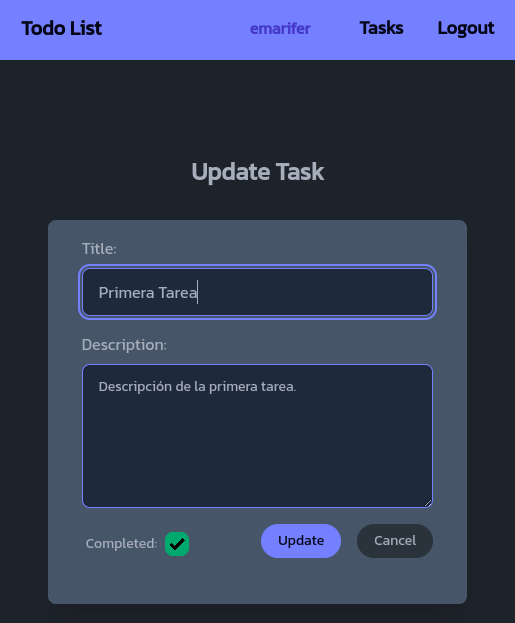
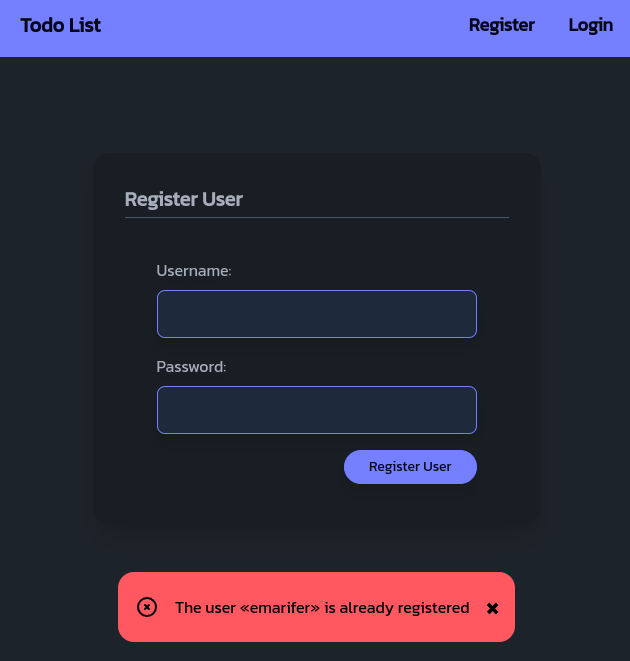
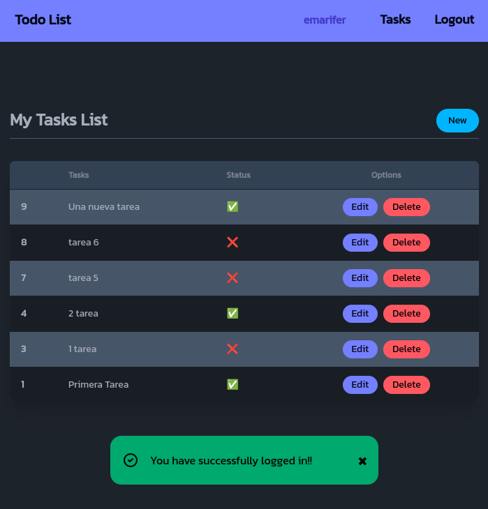

# 📝 Flask HTMX To-Do List

<div align="center">


</div>

## 📝 Table of Contents
- [English](#english)
  - [Description](#description)
  - [Features](#features)
  - [Technologies](#technologies)
  - [Installation](#installation)
- [العربية](#العربية)
  - [الوصف](#الوصف)
  - [المميزات](#المميزات)
  - [التقنيات](#التقنيات)
  - [التثبيت](#التثبيت)

---

## English

### Description
A modern web-based to-do list application with user registration and login. Built with Python, Flask, and SQLite, it features a dynamic HTMX-powered frontend styled with Tailwind CSS and DaisyUI. Each user can manage their own personal tasks.

### Features
✨ **Core Features**
- User registration and login
- Add, view, update, and delete personal to-do tasks
- Responsive and interactive interface (HTMX, Tailwind CSS, DaisyUI)
- Flash messages for feedback

🚀 **Technical Features**
- Modular Flask blueprints
- Secure password hashing
- SQLite database integration
- SPA-like experience with HTMX (no full page reloads)

### Technologies
- **Backend**: Python, Flask, Flask-SQLAlchemy
- **Database**: SQLite
- **Frontend**: HTML5, CSS3, HTMX, Tailwind CSS, DaisyUI, hyperscript

### Installation
1. **Clone the repository**
```bash
git clone https://github.com/H7ugf/projects_py.git
cd flask-htmx-todolist-main
```
2. **(Optional) Create a virtual environment**
```bash
python -m venv .venv
# Activate it:
# On Windows:
.venv\Scripts\activate
# On Unix/MacOS:
source .venv/bin/activate
```
3. **Install dependencies**
```bash
pip install -r requirements.txt
```
4. **Run the application**
```bash
python run.py
```
5. **Open in browser**
Visit `http://127.0.0.1:5000` in your web browser.

---

## العربية

### الوصف
تطبيق قائمة مهام (To-Do List) حديث عبر الويب مع تسجيل وتسجيل دخول المستخدمين. تم بناء التطبيق باستخدام بايثون وفريمورك فلاسـك وقاعدة بيانات SQLite، ويتميز بواجهة تفاعلية تعتمد على HTMX وبتصميم Tailwind CSS وDaisyUI. يمكن لكل مستخدم إدارة مهامه الخاصة.

### المميزات
✨ **الميزات الأساسية**
- تسجيل وتسجيل دخول المستخدمين
- إضافة، عرض، تعديل، وحذف المهام الشخصية
- واجهة تفاعلية ومتجاوبة (HTMX، Tailwind CSS، DaisyUI)
- رسائل تنبيهية للتغذية الراجعة

🚀 **الميزات التقنية**
- هيكلية منظمة باستخدام Blueprints في Flask
- تشفير كلمات المرور بشكل آمن
- تكامل مع قاعدة بيانات SQLite
- تجربة قريبة من تطبيقات الصفحة الواحدة (SPA) باستخدام HTMX

### التقنيات
- **الخلفية**: بايثون، فلاسـك، Flask-SQLAlchemy
- **قاعدة البيانات**: SQLite
- **واجهة المستخدم**: HTML5, CSS3, HTMX، Tailwind CSS، DaisyUI، hyperscript

### التثبيت
1. **استنساخ المستودع**
```bash
git clone https://github.com/H7ugf/projects_py.git
cd flask-htmx-todolist-main
```
2. **(اختياري) إنشاء بيئة افتراضية**
```bash
python -m venv .venv
# لتفعيل البيئة:
# على ويندوز:
.venv\Scripts\activate
# على لينكس/ماك:
source .venv/bin/activate
```
3. **تثبيت المتطلبات**
```bash
pip install -r requirements.txt
```
4. **تشغيل التطبيق**
```bash
python run.py
```
5. **فتح في المتصفح**
انتقل إلى `http://127.0.0.1:5000` في متصفحك.

---

## 👨‍💻 Developer
- **Name**: م محمد علي حزام
- **GitHub**: [H7ugf](https://github.com/H7ugf/projects_py.git)

## 📄 License
This project is licensed under the MIT License - see the [LICENSE](LICENSE) file for details.


<div>




</div>
